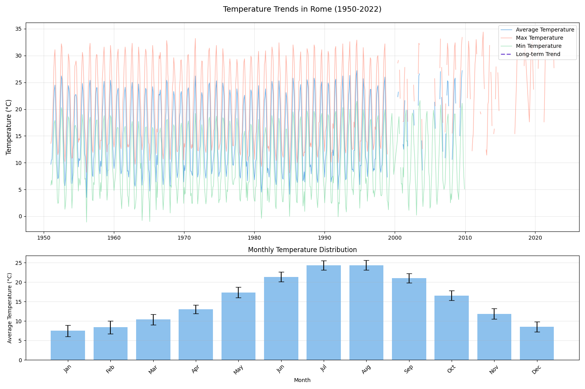
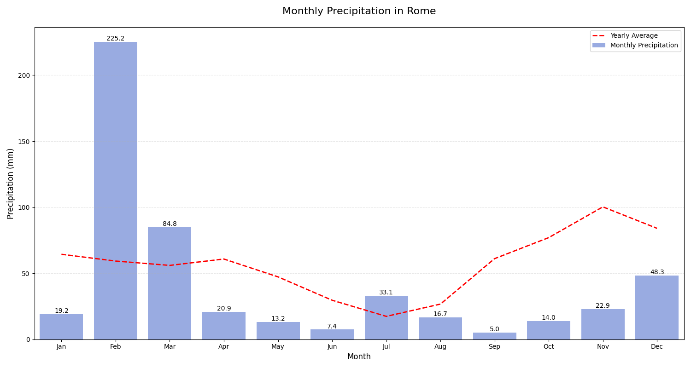

+++
date = "2024-11-19T14:52:27Z"
title = "Rome Weather Analysis Project"
draft = false
image = "../../img/portfolio/comprehensive-weather-analysis.png"
showonlyimage = false
weight = 2
+++

## 📊 Comprehensive Climate Study (1950-2022)

A detailed analysis of Rome's changing climate using advanced data analysis and machine learning techniques. This project offers insights into temperature trends, precipitation patterns, and climate change indicators using historical weather data.

[View on GitHub](https://github.com/PrashanthReddy47/Rome-Weather-Analysis-Notebook) | [Live Dashboard](https://roma-weather-analysis.streamlit.app/)

---

## 🌡️ Key Metrics

- **Time Range:** 72 Years (1950 - 2022)
- **Data Points:** 26,280 Daily Weather Records
- **Temperature Range:** -1.1°C to 34.4°C (Historical)

## 📈 Analysis and Findings

### Temperature Trends (1950-2022)

- Clear seasonal temperature cycles identified
- Long-term warming trend evident in the data
- Peak temperatures observed in July-August
- Significant variations between seasons

### Precipitation Patterns

- Highest rainfall in February (~225mm)
- Driest month is September (~5mm)
- Clear seasonal precipitation pattern
- Significant year-to-year variability

### Variable Correlations

- Strong positive correlation (0.99) between average and maximum temperatures
- Strong positive correlation (0.98) between average and minimum temperatures
- Weak negative correlation (-0.35) between precipitation and temperature variables

### Machine Learning Models and Comprehensive Analysis

---

## 🔬 Technical Details

### Analysis Techniques

- Time series analysis
- Seasonal decomposition
- Statistical testing (Mann-Kendall, Shapiro-Wilk)
- Machine learning models
- Data visualization using matplotlib, seaborn

### Model Performance

| Model | R-squared (R²) |
|-------|----------------|
| Linear Regression | 0.884 |
| Ridge Regression | 0.884 |
| Lasso Regression | 0.838 |
| Random Forest | 0.918 |

---

## 📊 Data Source

The analysis uses the 'Roma_weather.csv' dataset, containing daily weather records from 1950 to 2022, including:

- Average temperature (TAVG)
- Maximum temperature (TMAX)
- Minimum temperature (TMIN)
- Precipitation (PRCP)

## 🛠️ Technologies Used

- Python
- Pandas, NumPy
- Matplotlib, Seaborn
- Scikit-learn
- Jupyter Notebooks