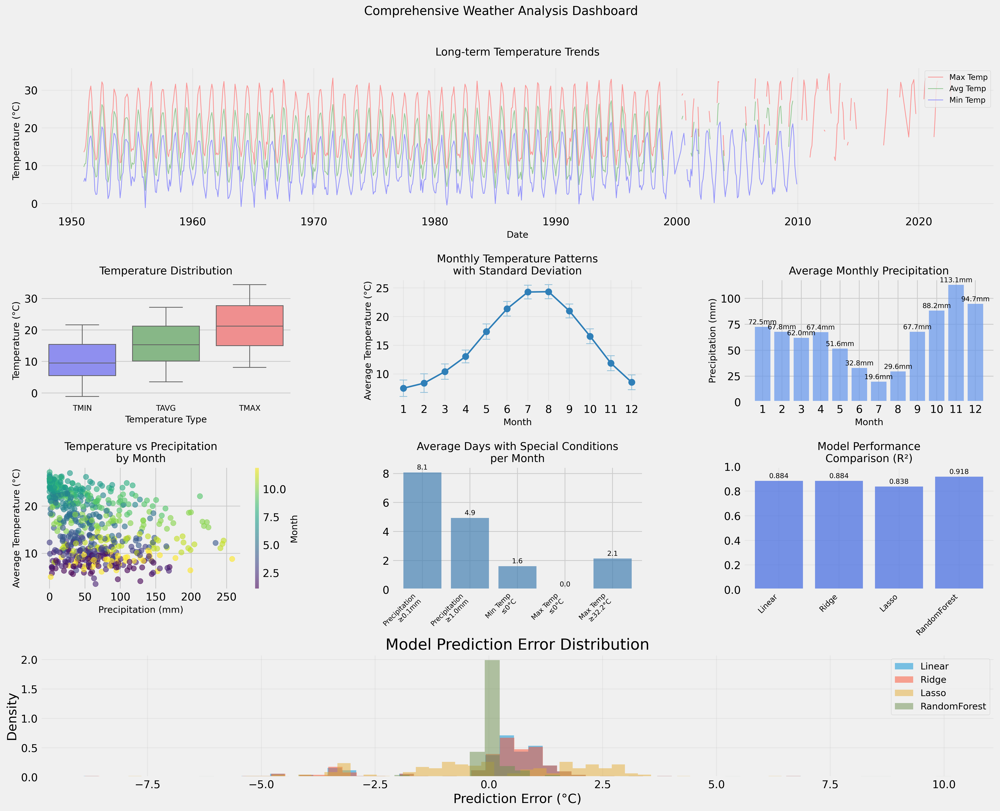

+++
date = "2024-11-05T19:41:01+05:30"
title = "Rome Weather Analysis Project"
draft = false
image = "../../img/portfolio/comprehensive-weather-analysis.png"
showonlyimage = false
weight = 2
+++

## Overview

This project analyzes weather data for Rome, Italy from 1950 to 2022. It uses data analysis and machine learning to study temperature trends, precipitation patterns, and climate change indicators.

[View Project on GitHub](https://github.com/PrashanthReddy47/Rome-Weather-Analysis-Notebook) | 
[View Live Dashboard](https://roma-weather-analysis.streamlit.app/)

## Project Details

- Time period: 1950 - 2022 (72 years)
- Data points: 26,280 daily weather records
- Temperature range: -1.1°C to 34.4°C

## Key Findings

### Temperature Trends

- Clear seasonal temperature cycles found
- Long-term warming trend observed
- Highest temperatures typically in July-August
- Significant temperature differences between seasons

### Precipitation Patterns

- February has the most rainfall (about 225mm)
- September is the driest month (about 5mm)
- Clear seasonal pattern in precipitation
- Rainfall amounts vary significantly year to year

### Weather Variable Relationships

- Strong positive correlation (0.99) between average and maximum temperatures
- Strong positive correlation (0.98) between average and minimum temperatures
- Weak negative correlation (-0.35) between precipitation and temperature

### Analysis Dashboard

This dashboard shows:
- Long-term temperature trends
- Monthly temperature and precipitation patterns
- Temperature distribution analysis
- Frequency of special weather conditions
- Performance comparison of machine learning models

## Technical Approach

### Analysis Methods

1. Time series analysis
2. Seasonal decomposition
3. Statistical tests: Mann-Kendall and Shapiro-Wilk
4. Machine learning models for temperature prediction
5. Data visualization

### Model Performance

| Model | R-squared (R²) |
|-------|----------------|
| Linear Regression | 0.884 |
| Ridge Regression | 0.884 |
| Lasso Regression | 0.838 |
| Random Forest | 0.918 |

The Random Forest model performed best in predicting average temperatures.

## Tools Used

- Python
- Pandas and NumPy for data handling
- Matplotlib and Seaborn for visualization
- Scikit-learn for machine learning
- Jupyter Notebooks for development
- Streamlit for the dashboard

## Data Source

The project uses the 'Roma_weather.csv' dataset, which includes daily records of:

- Average temperature (TAVG)
- Maximum temperature (TMAX)
- Minimum temperature (TMIN)
- Precipitation (PRCP)

## Potential Applications

This analysis can be useful for:

1. Monitoring climate change in Rome
2. Urban planning and resource management
3. Agricultural planning
4. Tourism industry planning
5. Environmental policy decisions

## Future Work

Potential next steps for this project:

1. Include satellite imagery analysis
2. Create future climate forecasts
3. Compare Rome's climate with other Mediterranean cities
4. Study effects on local ecosystems

For more information or to collaborate, contact [Your Email]