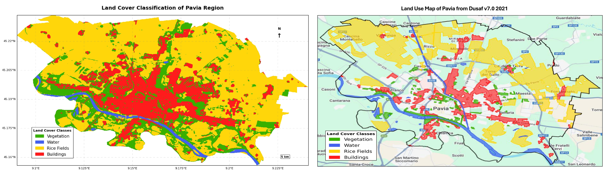

+++
date = "2023-12-31T19:41:01+05:30"
title = "Multi-Sensor Land Cover Classification in the Pavia Region Using Google Earth Engine"
draft = false
image = "img/portfolio/Pavia_Classification.png" 
showonlyimage = false
weight = 2
+++

This project implements a land cover classification system for the Pavia region in Italy, utilizing a fusion of Sentinel-1 and Sentinel-2 satellite data within the Google Earth Engine platform. The system distinguishes between four primary land cover types: **vegetation, water bodies, rice fields, and buildings**. By leveraging the strengths of both Synthetic Aperture Radar (SAR) and optical data, this project demonstrates improved accuracy and robustness in land cover mapping.

---

### **1. Introduction**

#### **1.1 Project Significance**

This research is significant due to its multi-sensor approach, utilization of open-access data from the European Space Agency's (ESA) Copernicus Program, efficient use of minimal training data, and its implementation on the Google Earth Engine platform, showcasing a scalable approach to processing and analyzing large volumes of satellite data.

#### **1.2 Potential Applications and Future Enhancements**

- This project's accurate land cover classification lays the foundation for applications in urban planning, agricultural management, water resource management, and environmental conservation.
- Future enhancements could involve extending the classification to more detailed land cover classes, implementing time series analysis for change detection, integrating additional data sources, and developing automated update mechanisms.

---

### **2. Data Sources and Processing Environment**

#### **2.1 Sentinel-1**

*   C-band Synthetic Aperture Radar (SAR) data
*   All-weather, day-and-night imaging capability
*   Dual polarization: VV and VH
*   10m spatial resolution (Ground Range Detected)

#### **2.2 Sentinel-2**

*   Multi-spectral optical imagery
*   13 spectral bands: 4 at 10m, 6 at 20m, and 3 at 60m resolution
*   Bands used: B2, B3, B4, B5, B6, B7, B8, B11, B12

#### **2.3 Google Earth Engine (GEE)**

*   Cloud-based platform for Earth observation data analysis
*   Provides access to a multi-petabyte catalog of satellite imagery and geospatial datasets
*   Offers powerful APIs for data processing and analysis

#### **2.4 DUSAF v7.0 2021**

*   Reference dataset for validation
*   Comprehensive land cover information for the Lombardy region
*   Used to generate independent validation points

---

### **3. Methodology**

#### **3.1 Study Area**

The study focuses on the Pavia region in Italy, known for its diverse land cover types, including urban areas, agricultural lands (particularly rice fields), and water bodies.

#### **3.2 Data Preprocessing**

1.  **Sentinel-1 Preprocessing:** Thermal noise removal, radiometric calibration, terrain correction, and speckle filtering
2.  **Sentinel-2 Preprocessing:** Cloud masking, atmospheric correction, and resampling to 10m resolution

#### **3.3 Feature Engineering**

1.  **Spectral Indices:** NDVI, NDWI
2.  **Texture Measures** (for Sentinel-1): Variance of VV and VH bands
3.  **Band Ratios and Normalizations:** VH/VV ratio, Normalized VH and VV bands

#### **3.4 Classification**

This project employed two classifiers: Random Forest and Support Vector Machine (SVM).

1.  **Random Forest Classifier:**
    *   Number of trees: 500
    *   Variables per split: null (uses all)
    *   Minimum leaf population: 1
    *   Bag fraction: 0.7
    *   Seed: 42

2.  **Support Vector Machine (SVM):**
    *   Kernel: RBF
    *   Gamma: 0.5
    *   Cost: 100

#### **3.5 Post-processing**

1.  Mode filtering with a 2-pixel radius
2.  Majority filtering with a 1-pixel radius

#### **3.6 Training Data Generation**

*   Deliberately small dataset for testing purposes
*   Distribution:
    *   Vegetation: 30 points from 3 polygons
    *   Water Bodies: 21 points from 2 polygons
    *   Rice Fields: 15 points
    *   Buildings: 10 points
*   Small sample size allows for quick iterations during development

#### **3.7 Validation Data Generation**

*   Based on DUSAF v7.0 2021 methodology
*   300 independent validation points per class (1,200 total points)
*   Stratified random sampling
*   Equal distribution across classes for balanced accuracy assessment

---

### **4. Results and Performance**
#### Land Cover Classification Map


**Left map** displays the final land cover classification for the Pavia region, resulting from the integration of Sentinel-1 and Sentinel-2 data and the application of the Random Forest classifier.
*   **Vegetation** is represented in **green**.
*   **Water bodies** are depicted in **blue**.
*   **Rice fields** are shown in **yellow**.
*   **Buildings** are highlighted in **red**. 
The map effectively visualizes the spatial distribution of these four land cover classes.

The **"Land Use Map of Pavia from Dusaf v7.0 2021" (Right)** is a reference dataset used for validation in the land cover classification project. This dataset provides comprehensive land cover information for the Lombardy region, making it a reliable source for assessing the accuracy of the classification results. The project utilizes a stratified random sampling approach with equal distribution across the four land cover classes: vegetation, water bodies, rice fields, and buildings. This ensures a balanced and unbiased evaluation of the model's performance.

#### **4.1 Classification Accuracy**

```
---------------------------------------------------------
| Classifier      | Overall Accuracy | Kappa Coefficient|
---------------------------------------------------------
| Random Forest   | 81.33%           | 0.75             |
| SVM             | 25.83%           | 0.010            |
---------------------------------------------------------
```

#### **4.2 Class-specific Performance (Random Forest)**

```
-------------------------------------------------------------------
| Class         | Producer's Accuracy| User's Accuracy | F1-Score |
-------------------------------------------------------------------
| Vegetation    | 62.67%            | 73.15%          | 0.68      |
| Water Bodies  | 76.33%            | 99.57%          | 0.86      |
| Rice Fields   | 97.67%            | 79.84%          | 0.88      |
| Buildings     | 88.67%            | 76.88%          | 0.82      |
-------------------------------------------------------------------
```

#### **4.3 Feature Importance**

The top 10 features by importance are NDWI, NDVI, B5, VH\_norm, B4, VH, B3, VH\_var, B2, and B12.

#### **4.4 Confusion Matrix (Random Forest)**

```
[192, 1, 50,  57]
[32, 229, 22, 17]
[4,  0,  293,  3]
[33,  0, 1,  266]
```

---

### **5. Discussion**

#### **5.1 Performance Analysis**

The Random Forest classifier significantly outperformed the SVM, likely due to its ability to handle high-dimensional data, robustness to overfitting, and its ensemble nature.

#### **5.2 Feature Importance Insights**

The high importance of NDWI and NDVI highlights their effectiveness in capturing vegetation and water characteristics.

#### **5.3 Class-specific Performance**

Water bodies exhibited the highest user's accuracy, indicating reliable water detection. Rice fields had the highest producer's accuracy, suggesting effective identification of this crop type. Vegetation and buildings showed lower accuracies, potentially due to spectral similarities or mixed pixels.

#### **5.4 Integration of SAR and Optical Data**

Integrating Sentinel-1 and Sentinel-2 data improved classification accuracy compared to using optical data alone.

#### **5.5 Validation Process**

Using DUSAF v7.0 2021 with stratified random sampling ensures an independent and comprehensive accuracy assessment.

---

### **6. Conclusion and Future Work**

The project successfully demonstrated the potential of integrating Sentinel-1 and Sentinel-2 data for improved land cover classification in the Pavia region using Google Earth Engine.

Future work could explore advanced machine learning techniques, incorporate temporal features, extend the classification to more detailed classes, implement object-based classification, and investigate the model's transferability to other regions.

