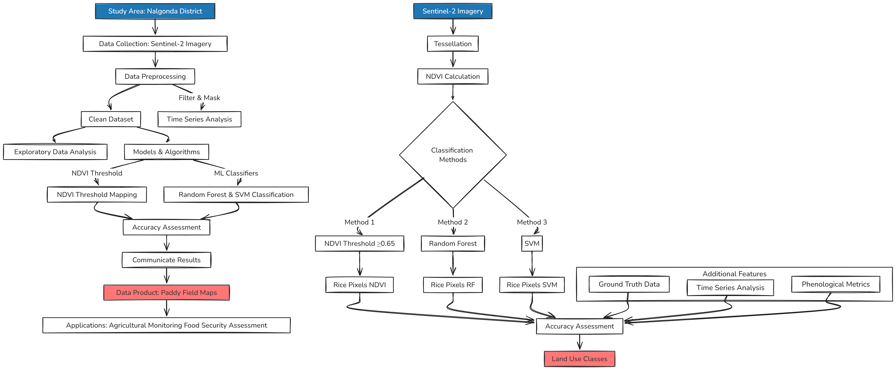
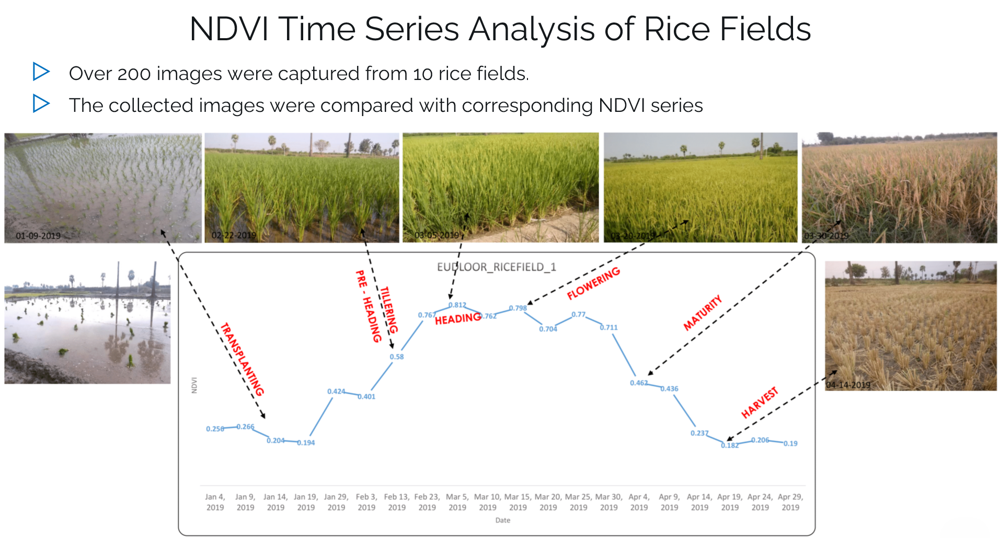

**Published Research:** This project evolved into a [peer-reviewed publication](/publication/rice-paddy-mapping/) achieving 93.3% accuracy in mapping 732,345 hectares of rice cultivation across Telangana, India.

---

In this project, I developed a comprehensive methodology for accurate and efficient mapping of paddy fields in the Nalgonda District, India, using multi-temporal Sentinel-2 imagery. The study employed three approaches: NDVI thresholding, Random Forest classification, and Support Vector Machine (SVM) classification. The research focused on the Rabi season from December 2019 to May 2020, analyzing the unique phenological patterns of paddy growth to improve classification accuracy.

#### Methodology Overview:

---

#### Key Components:

1. **Data Acquisition and Preprocessing**
   - Utilized Google Earth Engine for cloud-free Sentinel-2 imagery acquisition
   - Implemented atmospheric corrections and cloud masking (<20% cloud cover)
   - Created 10-day composites for consistent temporal coverage (18 images total)

2. **NDVI Threshold Approach**
   - Established optimal threshold (0.65) for paddy field identification
   - Analyzed phenological stages:
     - Plantation start: December
     - Peak growth: March
     - Harvest: June/July
   - Generated binary mask for paddy pixels

3. **Machine Learning Classifications**
   - Random Forest (RF) and Support Vector Machine (SVM) classifiers
   - Training data: 700 paddy points, 300 non-paddy points
   - Features: multi-temporal NDVI values and spectral bands

---

4. **Time Series Analysis**

---

5. **Accuracy Assessment**
   - Confusion matrices for RF and SVM classifications
   - Comparison with ground truth data
   - McNemar's test for statistical comparison of methods

#### Technologies Used:
- Google Earth Engine (JavaScript API)
- Python for data analysis and machine learning
- Remote sensing techniques (NDVI, spectral indices)
- Machine learning algorithms (Random Forest, SVM)

#### Results and Visualizations:

- NDVI Threshold Method: Efficiently captured paddy growth cycle
- Random Forest: 86% accuracy
- SVM: 80% accuracy

#### Impact and Applications:
This study demonstrates that the NDVI threshold method can be as effective as complex machine learning approaches while being more time and resource-efficient. The methodology developed can be adapted for mapping other crops with distinct phenological patterns, potentially revolutionizing large-scale crop monitoring practices.

The project contributes to:
- Improved agricultural monitoring systems
- Enhanced decision-making in crop management
- Food security assessments
- Agricultural policy-making support

This approach is particularly valuable in regions with limited resources for extensive ground surveys because it provides a cost-effective and accurate method for paddy field mapping.
